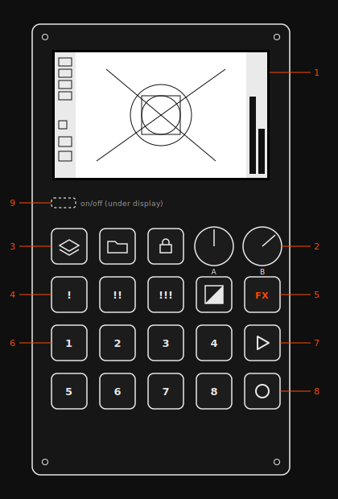

# pocket video synthesizer · operator's guide

**#po10diy by rmna** — a two-color video synthesizer in the pocket operator format. eight generative layers, an eight-step sequencer, momentary effects, an onboard screen and a dvi port for projectors.

*homage to teenage engineering's pocket operator™ series · built for the #po10diy contest*

> prefer it styled? [index.html](index.html) is this same guide as a self-contained web page — download it and open, or host it anywhere.

---

## 01 · panel layout

*fig. 1 — front panel. rear side (not shown): feather rp2040 board with usb-c + dvi ports, battery, 2 × 3.5 mm sync jacks.*

| # | control | what it does |
|---|---------|--------------|
| 1 | **screen** | 400×240 memory lcd. the middle is your canvas, the side strips are ui. |
| 2 | **knobs a + b** | the two parameters of the selected layer. a on the left, b on the right. |
| 3 | **icon keys** (layers, folder, lock) | reserved for future firmware: tempo, pattern folders, po sync. they do nothing yet. decorative ambition. |
| 4 | **variant keys** `!` `!!` `!!!` | pick one of three modes per layer. next to them: the **color key** flips black↔white. |
| 5 | **fx key** | hold it and press `1`–`8` for momentary effects. |
| 6 | **keys 1–8** | the heart of the machine. they trigger layers, place steps, and pick effects, depending on mode. |
| 7 | **play** | starts and stops the sequencer. |
| 8 | **write** | record mode. keys 1–8 become the 8 steps. |
| 9 | **power switch** | a slide switch tucked under the display's lower-left corner. see § 02 for a plot twist. |

## 02 · power

**on:** the slide switch hides under the display's lower-left corner. slide it **down**, toward you. yes, down. the switch was mounted in reverse on the pcb, and now it's a feature. the onboard screen wakes immediately.

**off:** slide it up. the machine has no state memory — your sequence lives only while the power is on.

**charging:** plug a usb-c cable into the feather board on the back.

## 03 · quick start — 60 seconds
!quick start (IMG_1542.png)
1. slide the power switch down. the screen lights up.
2. hold `1`. random lines fill the canvas. keep holding.
3. twist **knob a** and **knob b**. length, count, everything moves.
4. still holding `1`? tap `!!` then `!!!`. same layer, different personality.
5. tap the **color key**. black becomes white, white becomes black.
6. hold `FX` and press `7`. instant kaleidoscope. the mirrored pixels stay on the canvas after you let go — `FX` + `1` wipes the slate.
7. press **write** ●, tap a few of the keys `1`–`8`, press **write** again, then press **play** ▶. you made a video loop. congratulations.

## 04 · layers

each of the keys `1`–`8` is a **layer** — a little generative drawing machine. **hold a key** to punch its layer in live; release to stop it. hold several at once to stack them. pressing a layer key also makes it the **selected layer**, which is the one the knobs, variant keys and color key talk to.

| key | layer | knob a | knob b | `!` / `!!` / `!!!` |
|-----|-------|--------|--------|--------------------|
| 1 | **lines** — random line bursts | length & direction | line count | straight / diagonal / starburst rays |
| 2 | **rects** — mirrored rectangle pairs | max width · wipe thickness | max height · wipe speed | filled / outlined / rolling wipe |
| 3 | **glyphs** — character stamps on a grid | glyph size | glyph count | pipes & frames / symbols / letters |
| 4 | **doodles** — a shape orbiting the center | orbit swing & wobble | size & travel speed | circle / square / spinning triangle |
| 5 | **triangles** — morphing geometry | horizontal spread · radius | vertical spread · spin speed | mirrored twins / orbiting solo / orbiting solo |
| 6 | **grid** — lattices and cells | density | window · cell size · gap rhythm | line grid / square field / filled cells |
| 7 | **circles** — four breathing circles | radius range & pulse rate | spread from center | one flavor, three ways to hold it |
| 8 | **dust** — pixel sparkle on a grid | grid coarseness | density | one flavor |

*every layer redraws each frame on top of what's already there. nothing clears the screen for you — that's what fx 1 and 2 are for. trails are the point.*

## 05 · shaping a layer

**knobs a + b** — the two vertical bars on the right of the screen show their values for the selected layer. every layer remembers its own knob positions, so switching layers doesn't yank your settings around. the stored value only updates once you actually move a knob.

**variants** `!` `!!` `!!!` — each layer has up to three modes. tap one to switch the selected layer's mode. it sticks until you change it.

**color key** — flips the selected layer between draw-in-black and draw-in-white. the two little swatch squares in the left ui strip show which way it's currently pointing.

> **tip:** many knob mappings are cyclical — sweeping a knob slowly from end to end passes through several waves of a parameter. small movements, big drama.

## 06 · sequencer

the sequencer runs **8 steps** at a fixed **140 bpm** — one step per beat, techno tempo, as the badge on screen proudly declares. every step can hold any combination of the 8 layers, and each placed layer stores its own snapshot of knob a, knob b, variant and color **per step**.

1. **select a layer** — tap the layer key you want to sequence (it will flash on screen while held — that's normal).
2. **press write** ● — the record dot on screen fills in. keys `1`–`8` now mean **steps 1–8**, not layers.
3. **tap steps** — each tap toggles the selected layer on/off at that step, and stamps the current knob/variant/color settings into it. the mini step-grid on screen shows where your layer lands.
4. **vary it** — turn a knob or tap a variant, then place more steps. different steps, different flavors of the same layer.
5. **press write again** to exit, then **press play** ▶ — the loop runs, and the step cursor ticks around the on-screen grid.
6. **jam over it** — while the loop plays, hold layer keys to punch in live on top, or hold `FX` + a key to mangle everything.

> **note:** play always restarts from step 1, and stopping resets the position too. tempo is fixed in the current firmware — changing it is on the to-do list, along with pattern folders and po sync.

## 07 · fx

hold `FX`, then press and hold a key `1`–`8`. the effect applies for as long as you hold it. effects are performance gestures, not settings: they never get recorded into the sequence.

| fx + key | effect | what it does |
|----------|--------|--------------|
| 1 | **blackout** | fills the canvas black. a clean slate, or a strobe if you tap it. |
| 2 | **whiteout** | fills the canvas white. the other strobe. |
| 3 | **invert** | swaps black and white. *dvi out only* |
| 4 | **red ink** | everything drawn turns red. *dvi out only* |
| 5 | **mirror →** | the right half becomes a mirror of the left. |
| 6 | **mirror ↓** | the bottom half becomes a mirror of the top. |
| 7 | **kaleido** | the top-left quadrant is mirrored four ways. instant symmetry. |
| 8 | **red paper** | the background turns red, the ink turns black. *dvi out only* |

*two quirks worth knowing. the palette effects (3, 4, 8) only show on the dvi output — the onboard screen is strictly 1-bit — and they stay latched until you release the fx key itself, not just the number key. the mirror effects (5, 6, 7) paint real pixels: their symmetry stays on the canvas after you let go, until something draws over it or you wipe with fx 1 / 2.*

## 08 · the screen

the middle 320×240 is the canvas — it's exactly what the dvi port sends out. the two 40-pixel strips on the sides are the control room:

**left strip**

| | |
|---|---|
| a | **8 layer icons** — an icon inverts while its layer is drawing (punched in, or active on the current step). |
| b | **selection mark** — a small line beside the icon of the selected layer. |
| c | **color swatches** — which of black/white the selected layer draws with. |
| d | **tempo badge** — reads "techno". it means 140 bpm. |
| e | **step grid** — 2×4 cells. the cursor ticks around it while playing; in write mode, dots mark the steps holding your selected layer. |
| f | **play + record icons** — filled when active. |

**right strip**

| | |
|---|---|
| g | **knob a bar** — stored value of knob a for the selected layer. |
| h | **knob b bar** — stored value of knob b for the selected layer. |

## 09 · outputs

**dvi video out** — the port on the feather board (rear). connect to any dvi/hdmi display or projector; the synth outputs 640×480 @ 60 hz (the 320×240 canvas, pixel-doubled). the side ui strips stay on the onboard screen — the audience only sees the art.

**sync jacks** — two 3.5 mm jacks on the rear, wired for pocket operator sync. firmware support is still to-do, so for now they are decorative ambition. one day: video locked to your po-12's kick drum.

## 10 · good to know

- **selecting = triggering.** tapping a layer key to select it also draws it for a moment. there is no silent select — treat the flash as confirmation.
- **knobs write instantly.** moving a knob immediately updates the selected layer's live settings. park your knobs before a performance, or use it as a feature.
- **steps are snapshots.** a step remembers the knob/variant/color values from the moment you placed it. re-tap the step twice (off, then on) to re-stamp it with new values.
- **trails are free.** the canvas is never cleared automatically. layers accumulate into dense textures — use fx 1 / fx 2 as your eraser and rhythm section.
- **no save.** power off and the sequence is gone, like a sand mandala. record your output if you love it.
- **hackable.** every layer is a small arduino function, and `layers.ino` ships with a commented template. write your own layer no. 9.

**warnings**

- strobe-capable device — mind photosensitive viewers when projecting fx 1/2/3.

## 11 · in the works

the firmware isn't finished — it's a living thing. from the repo's to-do list:

- **po sync** — lock the step clock to a master pocket operator. the jacks and the input circuit are already on the board, waiting.
- **tempo** — the classic po presets (hip hop 80 / disco 120 / techno 140) instead of a fixed 140.
- **pattern folders** — more than one sequence, switched with the folder key.
- **silent layer select** — pick a layer without triggering it, via the layers key.

*the three icon keys below the screen are reserved for exactly these. when the firmware catches up, so will this guide.*

## 12 · specifications

| | |
|---|---|
| cpu | raspberry pi rp2040, dual-core (adafruit feather rp2040 dvi) |
| display | 2.7″ sharp memory lcd, 400×240, 1-bit |
| video out | dvi, 640×480 @ 60 hz (320×240 pixel-doubled) |
| colors | 2 — black and white. 3 with fx, if you count red. we count red. |
| engine | 8 layers × 8 steps × 4 parameters (a, b, variant, color) |
| tempo | 140 bpm, fixed (for now) |
| controls | 18 keys, 2 potentiometers, 1 power switch |
| sync | 2 × 3.5 mm jacks, po-sync ready (firmware pending) |
| power | 400 mah lipo, usb-c charging |
| cost | ≈ $100 in parts |

## 13 · make your own

this machine isn't for sale — it's for building. the repository contains the full kicad project, exported gerbers, a bill of materials, step-by-step assembly instructions, and the arduino firmware. order the pcb, melt some solder paste, and send the maker a picture when yours boots.

full story: [ramona.diy/video-art/po-video](https://ramona.diy/video-art/po-video) · hardware, firmware & build guide: [github.com/ramonaisonline/po10diy](https://github.com/ramonaisonline/po10diy)

---

*pocket video synthesizer — designed by ramona sharples (rmna) for the #po10diy contest. this guide was written from the firmware source. pocket operator™ is a trademark of [teenage engineering](https://teenage.engineering); this is an unaffiliated homage.*
